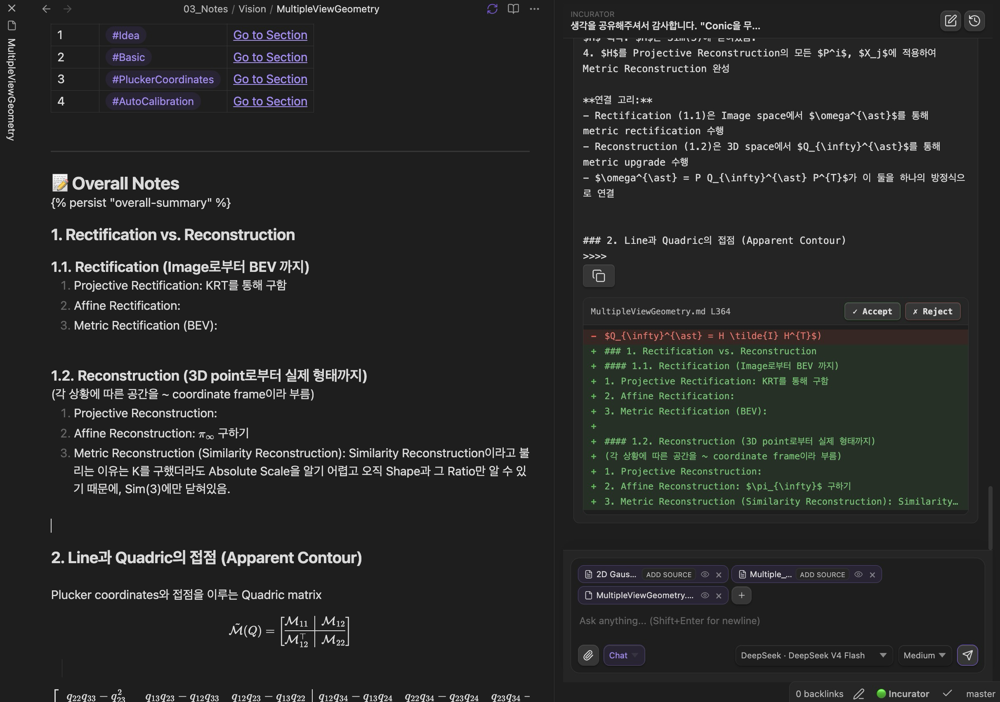
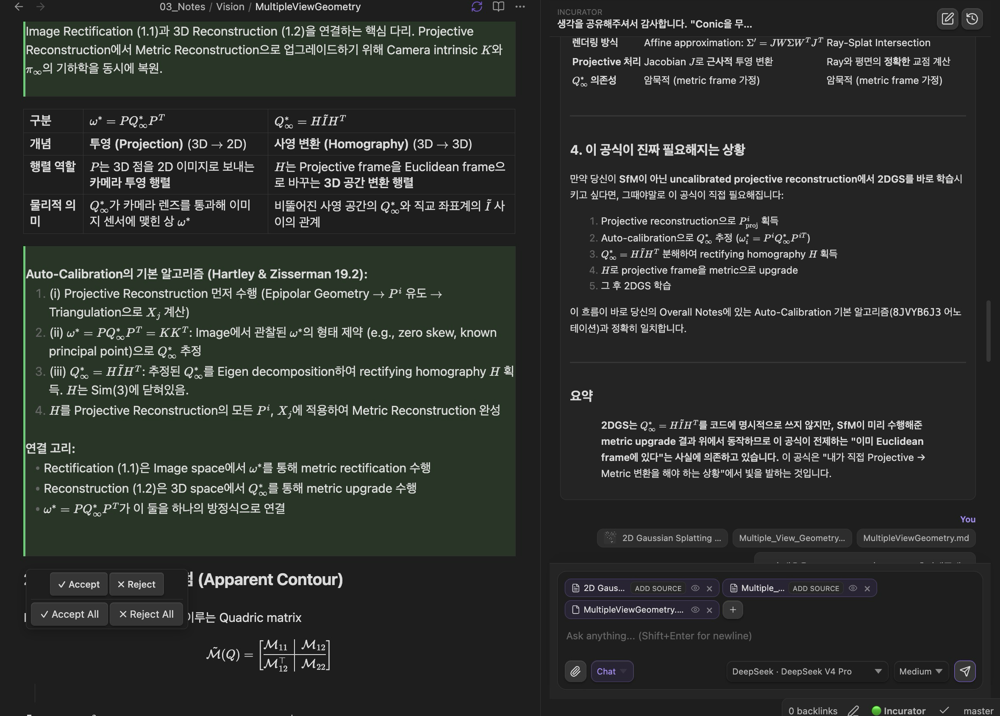
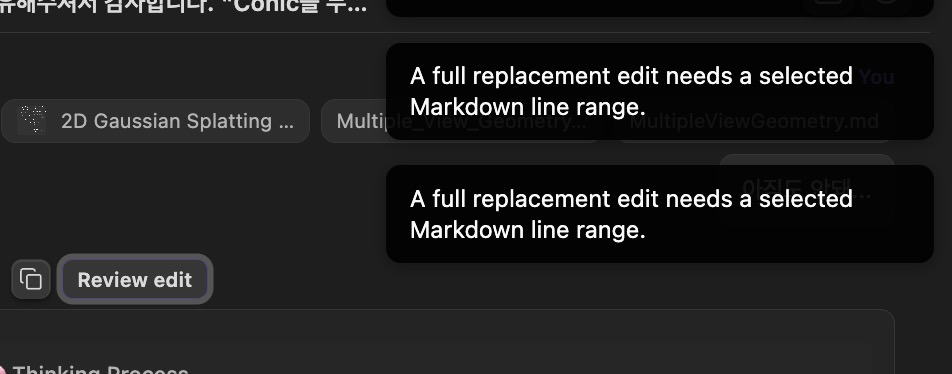
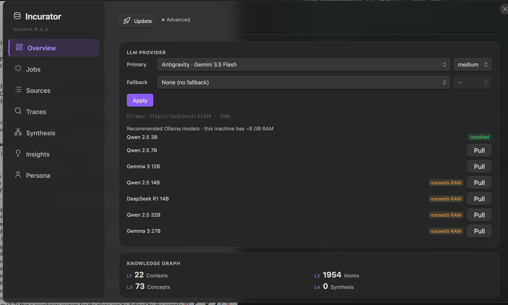

# User Report

This document is a **plain Inbox (backlog) log** that records bugs reported by the user, required features, ideas, etc., in chronological order without any filtering.

Agents must check this document and triage the received items into the `To-Do (Queuing)` area or `Icebox` area of `.agents/ROADMAP.md`. Once the triage is complete, **immediately delete** the item from this document.

## 📝 User Inbox

- **[hotfix] popover Ask AI에 수식 포함해서 드래그했을 때, 수식 포함안됨.**
Obsidian의 라이브 프리뷰(Live Preview) 모드에서는 수식을 클릭하거나 드래그할 때, 화면에 보이던 MathJax(SVG) 위젯을 마크다운 텍스트($...$)로 실시간으로 교체(스왑)하는 작업이 일어납니다.

문제는 마우스를 놓는 순간(mouseup) 팝오버가 텍스트를 읽어오는데, DOM 요소가 텍스트로 완전히 교체되기 직전(또는 교체되는 도중)의 이전 상태(SVG)를 읽어버리기 때문에 수식이 통째로 날아가는 현상이 발생합니다. 이 문제 해결해야합니다.

그리고 드래그 했을 때 자체에 ask ai 가 나와야하는데 키보드로 영역 표시 (shift 화살표눌러서) 했을때는 ask ai 가 호버링 안됩니다.

- [hotfix] 와 같이 넣으면 "### 2. Line과 Quadric의 접점 (Apparent Contour) 
>>>>" 이런거 뜨기도하고 .md 파일에 diff 랑 호버링 안뜸. 질문은 "4번 내용을 Overall note의 1.3. 으로 추가해줄래?" 였음. 4번은

```
4. 이 공식이 진짜 필요해지는 상황

만약 당신이 SfM이 아닌 uncalibrated projective reconstruction에서 2DGS를 바로 학습시키고 싶다면, 그때야말로 이 공식이 직접 필요해집니다:

Projective reconstruction으로  획득

Auto-calibration으로  추정 ()

 분해하여 rectifying homography  획득

로 projective frame을 metric으로 upgrade

그 후 2DGS 학습

이 흐름이 바로 당신의 Overall Notes에 있는 Auto-Calibration 기본 알고리즘(8JVYB6J3 어노테이션)과 정확히 일치합니다.
``` 임. 

방금 또 찾아냄. 
 모델의 추론능력마다 조금씩 다르네 이게. 아까는 추론능력이 적은모델이고 이건 높은모델임. 이거는 diff 나오긴하는데, 난 채팅 답변중에서 4번에 대해서 (오른쪽 화면에서 볼수 있음) 추가해줘. 했는데 답변 전체에 대해서 글을 추가해줌.

 그리고 diff 할때 수정이 몇개됐는지 알수도없고 (예를 들어, 1/8)  수정 내용 움직이는 화살표도 없네. 
 
 Review diff 눌러야 diff 뜨게하지말고 바로 뜨게해줘
그리고  이런 버그도 있어서 md파일에 diff 안뜸.

ai-agent-edit이 자꾸 SEARCH 매칭에 실패하는 것 같습니다. 라는데?

- **[sidechat] partial selection + LaTeX 복사 불가 문제**: MathJax가 수식을 SVG로 교체하는 구조 때문에 드래그 선택 영역만 LaTeX 포함해서 복사하는 게 불가능. `pointer-events: none` CSS 시도 및 Cmd+Shift+C / 우클릭 메뉴 시도 모두 전체 메시지 복사만 되어 revert. 근본 해결책 후보: (1) MathJax 대신 KaTeX로 교체 — KaTeX는 DOM 텍스트 노드를 보존해서 브라우저 selection이 수식을 가로질러 작동함, (2) 각 `mjx-container` 위에 LaTeX 소스를 담은 투명 텍스트 overlay `<span>` 을 얹는 방식. 우선순위 낮음.
- PDF LaTeX 변환 기능(우클릭 "Convert to LaTeX")에서 사용하는 LLM 모델을 사용자가 선택할 수 있도록 settings에 "Fast/Light model" 옵션 추가 필요. 현재는 메인 모델을 그대로 사용하는데, LaTeX 변환처럼 간단한 작업엔 qwen2.5:0.5b 같은 경량 로컬 모델을 별도 지정할 수 있어야 함. Ollama 사용자 기준 추천 기본값은 `qwen2.5:0.5b`. 더 작은 용량 쓸수 있는거 있으면 찾아봐.

- obsidian agent가 한 채팅 세션 안에 있는 모든 기록을 답변할 때 사용하지? 안되있으면 되게 하는게 좋은지 인터넷에서 최신기법같은거 뒤져서 확인해보고 (노트 특화), 만약 만들었거나 있으면 채팅창 compat 하는 기능 추가해야함. 채팅 세션 최대 길이 (최대 토큰 길이) 만큼 얼마나 찼는지 원형 progress bar로 쿼리 표시 아래 실시간으로 표시되고 그 버튼 누르면 해당 채팅 세션 대화 기록 compat 되도록 해야겠다. 

- github cl (gh) 가 왜 설치해야는지 모르겠음. 이미 .git으로 관리중인데. sidechat에서 vault 내 파일들 history 참조하는 용도로 쓸라했거든. (예를 들어, 이거 예전에 내가 어떻게 썼더라? 어 이거 기록이 있었던거 같은데 지금 안보이네? ~시간 전에 썼던거 다시 복구하고싶음.) commit 이나 push같은 버전 관리는 직접함 (다른 플러그인 통해서, 거기는 gh 필요로 안함).

- project에 "0.4.0" 입력하면 docs던 client던 backend던 버전명 불일치하는부분이 많음. 지금 버전 변수 관리를 어디서 하는지 찾아보고 backend, plugin 등 모두 그 변수에서 관리하도록해 (backend: build_manifast.json, plugin: buildManifest.json 에서 버전 숫자 관리). (아마 manifest 에서 관리할듯) (불필요한 부분은 지우고.. docs 부분은 필요없을거같은데 어떻게 생각해) -> 아 이거 uv pip install 로 backend 설치해야하는데 어디서 pip install 로 설치한다. 범인 찾아야함. 왜 옵시디언에서 0.4.3 인데 0.4.2로 표시되지??? plugin 에서 그럼. manifest.json은 0.4.3 확인했는데. plugin이 읽는 wiki 위치랑 내가 터미널에서 실행한 wiki 위치가 다른가? 아 /Users/shin/.local/bin/wiki version으로 하면 버전이 0.3.2로 뜨고 그냥 wiki version 하면 0.4.3 뜨는데 plugin은 /Users/shin/.local/bin/wiki 읽어옴. 0.4.2 버전의 wiki도 어디 설치되어있나봐. uv tool 로 누가 설치했음. if shutil.which("uv"):
        # Explicitly target *this* interpreter: when `wiki` is installed via
        # `uv tool`, it lives in an isolated env under
        # `~/.local/share/uv/tools/incurator/`. Without `--python`, `uv pip`
        # may install into a different venv and the import will still fail.
        cmd = ["uv", "pip", "install", "--python", sys.executable,
               "llama-cpp-python"]

이런거 있네 from model_setup.py에. 

아 찾았다.  ./backend/.venv/bin/wiki version  incurator 0.4.2   -> 실제로 ./setup.sh 하면 업데이트되는거 uv run wiki version incurator 0.4.3 (incurator_project_path/.venv/bin/wiki version) 아나 backend 설치할때, uv pip install -e  ./backend 하던지 cd backend & uv pip install -e  . 하던지 둘중에 하나로 통일해라 정말. 여기저기   

- 에이전트 명령에 cd backend 써져있으니까 어떤건 프로젝트에 설치되고 어떤건 backend 에 설치되잖아. 다 외부에 설치되게 해라. 아 cd plugin 을 하던 cd backend를 했으면 cd .. 를 다시 해서 돌아와야지!!

- 0.4.2 changelog에 OBSIDIAN_PLUGIN_DIR 또는 .env  사용하는거 없애기로 했는데 cli.py 나 다른 곳에 build_env["OBSIDIAN_PLUGIN_DIR"] = "" 이런거 엄청 많아 아직도. 개발자는 프로젝트 루트의 setup.sh만 고쳤습니다.
체인지로그의 0.4.2 [Fixed] 항목을 자세히 보시면 시작 부분이 setup.sh plugin deploy로 되어 있습니다.
즉, 개발자는 프로젝트 최상단 폴더에 있는 setup.sh 파일 안의 로직을 고쳐서, 캐시 폴더(.cache/config/last_root)에 저장된 경로를 영리하게 읽어와 자동으로 복사하게 만들었습니다. 이 루트 스크립트를 쓰면 정말로 .env가 필요 없습니다. 하지만 plugin/deploy.sh는 까맣게 잊어버렸습니다.
개발자가 최상단의 통합 관리 스크립트(setup.sh)를 똑똑하게 업데이트해 놓고선, 정작 플러그인 폴더 안에 덩그러니 남겨져 있던 개별 실행용 스크립트(plugin/deploy.sh)는 옛날 코드 그대로 방치해 버린 것입니다. 루트의 setup.sh가 알아서 잘 한다고 해도, plugin/deploy.sh에 함정처럼 에러 코드가 남아있는 것은 명백한 버그입니다. 이전 답변에서 제가 안내해 드린 대로 plugin/deploy.sh 파일에서 exit 1 부분을 지우고 로컬 빌드로 넘어가도록(Fallback) 수정한 뒤 저장하시는 것이 완벽한 해결책입니다.

- backend dashboard에서 모델을 바꿔도 다시 키면 계속 화면만 antigravity gemini 3.5 flash 로 뜸. 실제로 동작하는 모델은 wiki status로 확인해보면 그 전에 적용했던걸로 바뀌었는데도 불구하고.  Incurator git:(master) ✗ wiki status

╭──────────────────────────────────────────────────╮
│ incurator  @ /Users/shin/shinywings/second_brain │
╰──────────────────────────────────────────────────╯
                            Config                             
  Primary                   Ollama  (qwen2.5:3b)               
  Fallback                  none                               
  Account                   Local (no account)         

  - 그리고 docs에 실제 사용하는 path 다 지워줄래 제발.