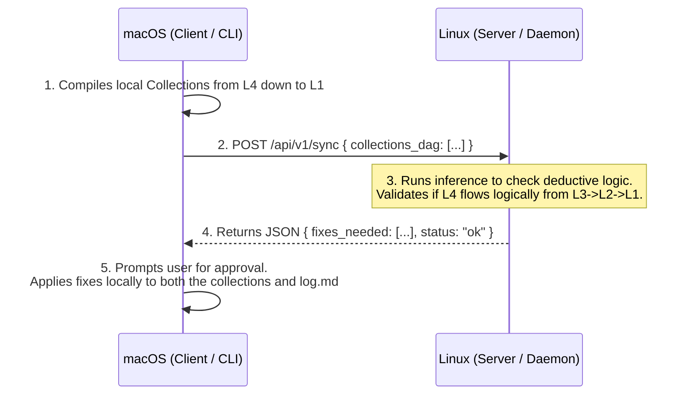

# 🧠 Agentic Zettelkasten v12.0: Deductive & Distributed Architecture Plan

This document completely revamps the LLM-Wiki CLI and workflow. It pivots from the legacy terminology to the **Agentic Zettelkasten** architecture, where:
- **`wiki add`** discovers new files.
- **`wiki curate`** extracts downstream layers.
- **`wiki sync`** acts as a **Deductive Logic Alignment Engine** (checking L4 down to L1).

---

## 1. Directory Structure Alignment (.curator/Collections/)

As specified in the new `README.md`, the abstraction space is organized into 4 logical layers:

```text
.curator/Collections/
├── 01_Accessions/  # L1: 1:1 original summaries and source metadata
├── 02_Fragments/   # L2: Minimum atomic units of verified knowledge (Atoms)
├── 03_Themes/      # L3: Intertwined, clustered conceptual units (Concepts)
└── 04_Curations/   # L4: Task-ready and agentic-packaged terminal context (Synthesis)
```

---

## 2. Renovated CLI Command Specifications

The core operations are refactored into distinct roles.

### 2.1 `wiki add` (Legacy: `wiki sync`)
* **Role:** Source Ingestion & Registration.
* **Input:** New/modified files in `02_Wiki`, `03_Notes`, `04_Resources`.
* **Output:** Generates L1 Accession summaries inside `.curator/Collections/01_Accessions/`. Updates the hash database (`log.md`).

### 2.2 `wiki curate` (Legacy: `wiki ingest`)
* **Role:** Top-Down Downstream Extraction (L1 $\rightarrow$ L2 $\rightarrow$ L3 $\rightarrow$ L4).
* **Input:** Layer 1 Accessions.
* **Output:** Extracts L2 Fragments, builds L3 Themes, and bundles L4 Curations context.

### 2.3 `wiki sync` (NEW: Deductive Verification & Back-Propagation)
* **Role:** Reverse DAG Verification & Logic Alignment (L4 $\rightarrow$ L3 $\rightarrow$ L2 $\rightarrow$ L1).
* **Input:** All 4 Collection layers.
* **Algorithm:**
  1. Starts at Layer 4 Curations (`SYN-`) and reads terminal claims.
  2. Recursively traces down to Layer 3 Themes (`CON-`), Layer 2 Fragments (`ATM-`), and Layer 1 Accessions (`SUM-`).
  3. Verifies if the top-level conclusion is logically deducible from the underlying raw facts.
  4. If a logical gap, misconception, or broken reference is found:
     - Prompts the user (HITL) with the exact contradiction.
     - Upon approval, corrects the upstream files (down to Layer 1 summaries) and cascades changes back up.
     - Synchronizes the new SHA-256 hashes into `log.md`.

---

## 3. Communication & Operations Flow

### Flow: `wiki sync` (Deductive Validation)



---

## 4. Required Codebase Changes

To implement this revised v12.0 architecture:

### 1. `src/llm_wiki/cli.py`
Rename and modify existing Typer commands:
- Rename `@app.command("sync")` to `add`.
- Add the new deductive `@app.command("sync")` command.
- Rename `@app.command("ingest")` to `curate`.

### 2. `src/llm_wiki/mcp_server.py`
Add explicit MCP tools for the new `sync` logical validation:
- Add `curator_validate_logic(node_id: str)` to run local deductive validation.

### 3. `src/llm_wiki/sync.py` & `src/llm_wiki/ingest.py`
- Rename `sync.py` functionality internally to support the `add` operations.
- Update `ingest.py` to target the new `01_Accessions/` through `04_Curations/` folder names.
- Create/Implement the deductive validation logic inside a new module `validate.py` or within `sync.py`.
