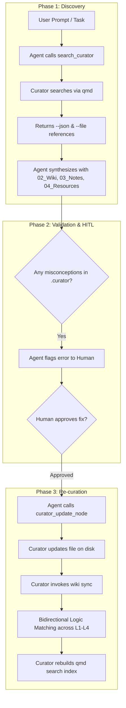
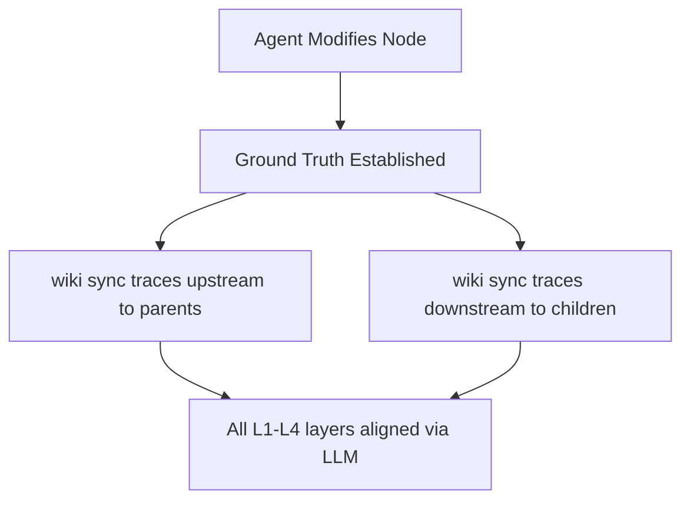

# Agent-Curator Knowledge Discovery & Correction Workflow Plan

This plan details the implementation steps to support the **3-Phase Agent-Curator Workflow**: Knowledge Discovery, Human-in-the-Loop Correction, and Automatic Re-curation.

---

## 1. Workflow Architecture



---

## 2. DAG Multi-Layer Logic Matching & Propagation

When any file (Atom, Concept, or Summary) is modified in the `.curator/` abstraction space, the entire conceptual branch becomes out of sync. To maintain complete knowledge graph integrity, the Curator invokes `wiki sync` to automatically trace, align, and validate both downstream and upstream files.



### Automatic Propagation Rules
1. **Bidirectional Dependency Tracking:** The `llm_wiki sync` tool traces file frontmatter metadata to identify both parent and child connections for the edited file.
2. **Upstream Alignment:** If an Atom was changed, it verifies if the Layer 1 summary still logically aligns.
3. **Downstream Cascade:** Any Layer 3 Themes and Layer 4 Curations linked to the modified file are automatically marked and updated.
4. **Layer 1 Hash Synchronization:** If a Layer 1 summary is corrected, the SHA-256 hash inside `.curator/log.md` is updated to prevent `wiki add` (legacy sync) from overwriting it.

---

## 3. Required Modifications

To enable this workflow, we must update the following files in the project.

### Part A: Update `mcp_server.py`
Add new tools to the MCP server to give the AI agent the capability to rewrite/fix the `.curator/` data and trigger a cascading update of the collections.

#### 1. Add `curator_update_node`
A tool allowing the agent to overwrite or update any specific node's content in the `.curator/` abstraction space (Layer 1-4).
```python
@mcp.tool()
def curator_update_node(node_id: str, new_content: str) -> dict[str, Any]:
    """Overwrites or updates a specific DAG node's content.
    Automatically handles downstream invalidation, log.md hash synchronization, 
    and LLM-driven re-curation.
    """
```

#### 2. Add `curator_reindex`
A tool allowing the agent to force a rebuilding of the `qmd` search engine index after the cascading update finishes.
```python
@mcp.tool()
def curator_reindex() -> dict[str, Any]:
    """Force-rebuilds the qmd semantic & lexical search index."""
```

#### 3. Add `curator_ingest_summary`
A tool that triggers a re-run of the pipeline for specific Layer 1 Summaries to correct cascading errors down to Layer 2-4.

---

### Part B: Update `mcp_usage_guide.md`
Add clear operational guidelines for the agent on how to use these tools in sequence.

```markdown
### 4. Advanced Agent Workflow (Discovery & Correction)

AI Agents should follow this multi-phase workflow when encountering user queries:

#### Step 1: Pre-requisite Discovery
Before answering, the agent must query `search_curator` to pull background context from the local Collections and raw files.

#### Step 2: Validation
Cross-reference the retrieved `.curator/` knowledge with original source files from `02_Wiki/`, `03_Notes/`, and `04_Resources/`.

#### Step 3: Human-in-the-Loop Fix
If the `.curator/` file contains a misconception, the agent must inform the user:
> ⚠️ I detected a misconception in `02_Atoms/ATM-abc12345.md`. Do you want me to update it?

#### Step 4: Rebuild
Upon user approval, the agent uses `curator_update_node` to update the file, followed by `curator_reindex` to refresh the index.
```

---

## 3. Implementation Steps

### Step 1: Implement the new MCP Tools
* Add `curator_update_node`, `curator_reindex`, and `curator_read_raw_file` (if not fully implemented) to `src/llm_wiki/mcp_server.py`.
* Ensure that the tools handle file writes securely within the `.curator/` boundaries.

### Step 2: Validate the Flow with Fast Tests
* Test that the agent can read a file, find a contradiction, prompt for human review, make the edit, and rebuild the search index cleanly.
