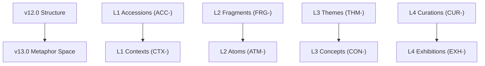

# Curator System Update Plan: Migration to v13.0 Schema

This plan outlines the end-to-end updates required to fully migrate the `llm_wiki` Curator codebase from `v12.0` to the updated **v13.0 Schema**. The transition introduces renamed layers, stricter metaphor-aligned directories/prefixes, updated frontmatter formats (e.g., bare-list YAML arrays for wikilinks), and revamped body formatting conventions.

---

## 1. Structural Migration: Layers & Directory Mappings

The primary change shifts from legacy research-focused terms to the **Compiler & Artist Metaphor** system.



| Layer | Legacy Paths (v12.0) | v13.0 Directory Paths | ID Prefix |
| :--- | :--- | :--- | :--- |
| **L1** | `01_Accessions/` | `01_Contexts/` | `CTX-` |
| **L2** | `02_Fragments/` | `02_Atoms/` | `ATM-` |
| **L3** | `03_Themes/` | `03_Concepts/` | `CON-` |
| **L4** | `04_Curations/` | `04_Exhibitions/` | `EXH-` |

---

## 2. Core Modules Update Plan

### A. Database Layer Alignment (`db.py`)
- **Action**: Update SQLite table creation scripts and apply safe migration paths.
- **Modifications**:
  - Rename `accessions`, `fragments`, `themes`, `curations` tables to `contexts`, `atoms`, `concepts`, `exhibitions`.
  - Add explicit data migration logic for existing users:
    ```sql
    ALTER TABLE IF EXISTS atoms RENAME TO atoms_old; -- etc.
    ```
  - Update ID column constraints: `ACC-*` -> `CTX-*`, `FRG-*` -> `ATM-*`, `THM-*` -> `CON-*`, `CUR-*` -> `EXH-*`.
  - In `contexts`, update the old `accession_id` column to `context_id`.
  - In `atoms`, rename `fragment_id` -> `atom_id`, and ensure `parent_source` stores plain string file paths instead of wikilinks.
  - Increment `SCHEMA_VERSION = 2`.

### B. Configuration (`config.py`)
- **Action**: Update directory manifests and dynamic layer parsing logic.
- **Modifications**:
  - Align collection layer directories mapping:
    ```python
    COLLECTION_LAYERS = (
        "01_Contexts",
        "02_Atoms",
        "03_Concepts",
        "04_Exhibitions"
    )
    ```
  - Re-alias dynamic properties of the `WikiPaths` class (`contexts`, `atoms`, `concepts`, `exhibitions`) for maximum compatibility.
  - Update any regex mappings or validator rules that expect `ACC-`, `FRG-`, `THM-`, `CUR-` to accept `CTX-`, `ATM-`, `CON-`, `EXH-`.

### C. Ingest & Content Generation (`ingest_llm.py`, `page_writer.py`, `prompts.py`)
- **Action**: Refactor output formatting schemas, dataclasses, and system prompts used by Pass 1, 2, and 3.

```mermaid
graph LR
    subgraph L1 Context [CTX-]
        C_Head["## Summary"]
    end
    subgraph L2 Atom [ATM-]
        A_Head["## Definition/Claim<br>## Context<br>## Constraints<br>## Relations"]
    end
    subgraph L3 Concept [CON-]
        B_Head["## 1. Core Architecture<br>## 2. Interaction of Atoms<br>## 3. Math Framework<br>## 4. Open Questions<br>## Relations"]
    end
    subgraph L4 Exhibition [EXH-]
        D_Head["- **1. Executive Brief**<br>- **2. Theoretical Foundation**<br>- **3. Actionable Directives**"]
    end

    L1 Context --> L2 Atom --> L3 Concept --> L4 Exhibition
```

#### Layer Generation Adjustments:
1. **L1 Context**:
   - Enforce fixed required section `## Summary`.
   - Dynamically extract content-specific numbered headings afterwards.
2. **L2 Atom**:
   - Set `parent_source: "01_Contexts/CTX-[UUID8]"` as a plain string without wikilink brackets.
   - Add required fields: `source_path` and `confidence_score`.
   - Remove `## Source` section. The terminal section is now `## Relations`, providing upstream cross-reference backlinks.
3. **L3 Concept**:
   - Generate `dependencies` using YAML bare-list format (e.g., `[[[02_Atoms/ATM-UUID8]], [[02_Atoms/ATM-UUID8]]]`).
   - Inject `confidence_score` into frontmatter.
   - Prompts must generate `## 3. Mathematical Framework` and a terminal `## Relations` section.
4. **L4 Exhibition**:
   - Generate `core_concepts` with YAML bare-list format (e.g., `[[[03_Concepts/CON-UUID8]]]`).
   - Restructure body format to use the **bold-bullet point list** (`- **1. Executive Brief**:`, etc.) instead of H2 headers.

#### Ingest Processing Enhancements (`ingest_llm.py`):
- Update `PageChange` layer strings from `01_Accessions` to `01_Contexts`, etc.
- In `_run_pass2_concepts`, update layer paths when fetching existing `atoms`.

---

## 3. Verification & Administrative Pages

### A. Logic Verification (`sync.py` & `lint.py`)
- **Action**: Adapt parsing logic to correctly resolve cross-layer links and YAML bare-lists.
- **Modifications**:
  - Update standard validators to handle the YAML bare-list brackets `[[[LAYER/ID]]]` without choking on standard wikilink tokens.
  - Revise downstream link tracing rules to use new IDs (`EXH → CON → ATM → CTX`).
  - Align validation rules to verify the removed `## Source` section from Atoms.

### B. Index and Control Plane Manifests (`page_writer.py`)
- **Action**: Update manifest building logic.
- **Modifications**:
  - **`.curator/index.md`**: Convert from standard Markdown table format to a frontmatter-backed layer-grouped bullet list schema:
    ```markdown
    ---
    title: "Curator Index"
    type: index
    updated: YYYY-MM-DDThh:mm:ssZ
    ---
    ## L1 — Contexts
    - [[01_Contexts/CTX-UUID|CTX-UUID]]
    ```
  - **`.curator/log.md`**: Update event logging logic to use the new frontmatter, event types (`add`, `curate`, `sync`, `lint`), and structured H2 logs.

---

## 4. MCP Server & CLI Endpoints (`cli.py`, `mcp_server.py`)

To retain cross-compatibility while supporting the new layer semantics:
- Refactor the `search_curator` MCP tool to accept updated layer enum scopes (`contexts`, `atoms`, `concepts`, `exhibitions`).
- Update the `curator_traverse_evidence` tool to trace downstream starting from `EXH` to `CON` to `ATM`.
- Align parameter names: e.g., `context_id` instead of legacy `accession_id`.
- Support the updated metadata format on all active terminal commands.

---

## 5. Execution Roadmap & Steps

1. **Phase 1: Foundation (DB & Config)**
   - Align `db.py` column constraints and table configurations.
   - Map structural layout directory names in `config.py`.

2. **Phase 2: Code Generation & Parsers**
   - Rework regex and frontmatter processors in `parsers/` to digest both quoted strings and bare-list YAML brackets.
   - Refactor `page_writer.py` to correctly structure `index.md` and `log.md`.

3. **Phase 3: Prompt Template Upgrades**
   - Adjust generation templates in `prompts.py` to enforce new heading and bold-bullet structures.

4. **Phase 4: Interface & Command Refactoring**
   - Update `cli.py`, `mcp_server.py`, `lint.py`, and `sync.py` to use metaphors and updated validation patterns.
   - Execute manual verification or run deductive validation `wiki sync` to confirm complete stability.
